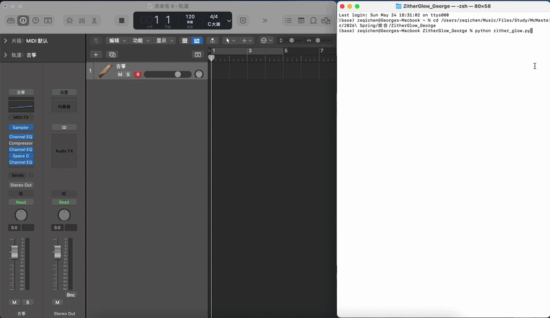

# 🏮 ZitherGlow: A Pentatonic MIDI AI Generator for Logic Pro

An intuitive, rule-bound generative MIDI assistant tailored for traditional Chinese instruments (such as the Guzheng). Built specifically for Logic Pro by a Computer Science student with a passion for music production.



> 🔊 **Listen with Sound:** Click the player below to watch the full system demonstration with crisp audio.
https://github.com/user-attachments/assets/7db5f246-3589-45db-afa2-54db7b8de236

---

## 🎵 Behind the Project: The "Why"

As a CS sophomore and an avid Logic Pro user, I’ve always admired Logic's **"Smart Drummer"** feature—how it naturally collaborates with producers by generating genre-specific grooves. However, when it came to melodic instruments, everything still required tedious, manual MIDI programming. 

This bottleneck became especially frustrating within my own cultural roots: **Traditional Chinese Instruments**. Logic Pro’s built-in instruments (like the Guzheng and Pipa) sound beautiful, but they lack advanced, intelligent tools to spark instant inspiration or automate authentic, flowing performance techniques.

With the massive rise of Generative AI platforms like **Suno** and **XStudio**, I realized that AI-assisted composition is no longer the future—it is the present. Driven by this industry trend, I wanted to combine my coding knowledge with my musical instincts. After researching system-level MIDI routing, I developed **ZitherGlow**—a lightweight, zero-latency "AI Session Musician" that sits right inside my terminal, streaming authentic pentatonic inspiration straight into Logic Pro.

---

## ✨ Features & Technical Highlights

Instead of deploying heavy, uncontrollable deep-learning models, **ZitherGlow** utilizes elegant, rule-bound algorithms to ensure 100% musical coherence while keeping resource usage close to zero.

*   **Scale Lock Mechanism:** Constraints random mathematical inputs into traditional Chinese pentatonic scales (e.g., *Gong Mode* for bright, epic/fantasy vibes, or *Yu Mode* for melancholic, cinematic/wuxia aesthetics). **Result: Zero wrong notes.**
*   **Humanization Engine:** Simulates real-world finger plucking by applying normal-distribution randomization to MIDI `velocity` (dynamics) and `micro-timing`.
*   **Musical "Rest" (留白) Logic:** Integrates traditional Chinese musical spacing. The AI dynamically calculates probability to skip notes, letting string resonances ring out naturally instead of firing notes continuously like a machine.
*   **Real-time DAW Capture:** Generates standard MIDI protocols natively on macOS. When Logic Pro's record button is pressed, the streamed live improvisation instantly converts into editable MIDI Regions on the timeline.

---

## 📦 File Architecture

```text
ZitherGlow_George/
│
├── zither_glow.py        # Main execution program with interactive CLI
├── requirements.txt      # Lightweight dependency configurations
└── README.md             # Documentation & Project Overview
```

---

## 🚀 Quick Start Guide

### 1. Prerequisites (macOS Only)
Ensure you have the core MIDI communication wrappers installed. Open your Terminal and run:
    pip install mido python-rtmidi


### 2. Setting up Logic Pro
1. Open Logic Pro and create a new project.
2. Add a new Software Instrument Track and load the built-in Guzheng (located under World -> Stringed).
3. Important: Click and highlight the Guzheng track header so it is active and armed to receive MIDI signals.

### 3. Running the Generator
1. Navigate to your project folder in Terminal:
    cd path/to/ZitherGlow_George
2. Run the script:
    python zither_glow.py
3. Follow the interactive prompts to choose your musical mode and tempo.
4. Instantly switch back to your Logic Pro window and listen to the melody flow. Press R in Logic to record the performance live!

### 🎨 Future Roadmap
* [ ] Implement Automatic Ornamentation (加花) to simulate rapid pitch glides and tremolos.
* [ ] Add a Velocity Curve Slider for customized dynamic phrasing.
* [ ] Develop a dual-track mode for automatic harmony generation (Zither + Flute).

Developed with 💻 and 🎹 by Zeqi Chen (George).
